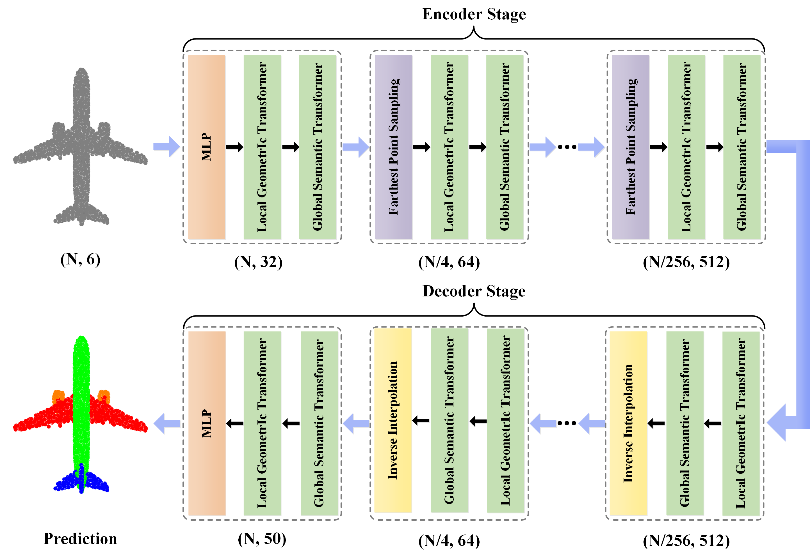
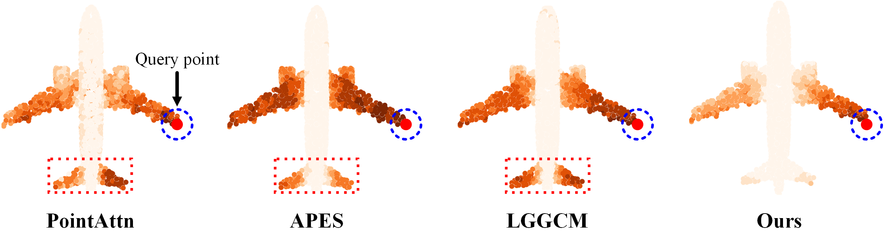

# [<font color="black">GSTran: Joint Geometric and Semantic Coherence for Point Cloud Segmentation (ICPR 2024)</font>](https://arxiv.org/pdf/2408.11558)

Learning meaningful local and global information remains a challenge in point cloud segmentation tasks. When utilizing local information, prior studies indiscriminately aggregates neighbor information from different classes to update query points, potentially compromising the distinctive feature of query points. In parallel, inaccurate modeling of long-distance contextual dependencies when utilizing global information can also impact model performance. To address these issues, we propose GSTran, a novel transformer network tailored for the segmentation task. The proposed network mainly consists of two principal components: a local geometric transformer and a global semantic transformer. In the local geometric transformer module, we explicitly calculate the geometric disparity within the local region. This enables amplifying the affinity with geometrically similar neighbor points while suppressing the association with other neighbors. In the global semantic transformer module, we design a multi-head voting strategy. This strategy evaluates semantic similarity across the entire spatial range, facilitating the precise capture of contextual dependencies. Experiments on ShapeNetPart and S3DIS benchmarks demonstrate the effectiveness of the proposed method, showing its superiority over other algorithms. 

<div align="center">
  
</div>

## Global Attention Visualization

<div align="center">
  
</div>

## Usage

### Requirements
- PyTorch >= 1.7.1
- python >= 3.7
- CUDA >= 11.0
- GCC >= 7.4.0
- torchvision

### Dataset
We utilize the **ShapeNetPart** dataset for 3D part segmentation and the **S3DIS** dataset for 3D semantic segmentation.

###  Part Segmentation Training

- Start training

  ```
  python main.py --batch_size 24 --data_path your_data_path --num_neighbor 24
  ```

### Semantic Segmentation Training

- Convert file.

  using the file `dataset/S3DIS/generate_npy.py` to convert the S3DIS dataset from `txt` to `npy` files. Remember to change `data_path` and `save_path` to your own path.

  ```
  python generate_npy.py
  ```

- Start training. 

  After training, the checkpoint is saved in `log/PointTransformer/semseg/train/xxxx-xx-xx/checkpoints`.

  ```
  python train_s3dis.py --batch_size 12 --data_path your_data_path --num_neighbor 24
  ```

- Start testing. 

  Once you run the command below, folder `log/PointTransformer/semseg/test` will be auto created. Placing the trained checkpoint mentioned above into the folder `log/PointTransformer/semseg/test/xxxx-xx-xx/checkpoints`.

  ```
  python test_s3dis.py --point_batch_size 12 --data_path your_data_path 
  ```

## Citation

If you find this repository useful, please consider giving a star :star: and citation :rocket:.

```bibtex
@article{li2024gstran,
  title={GSTran: Joint Geometric and Semantic Coherence for Point Cloud Segmentation},
  author={Li, Abiao and Lv, Chenlei and Mei, Guofeng and Zuo, Yifan and Zhang, Jian and Fang, Yuming},
  journal={arXiv preprint arXiv:2408.11558},
  year={2024}
}
```

